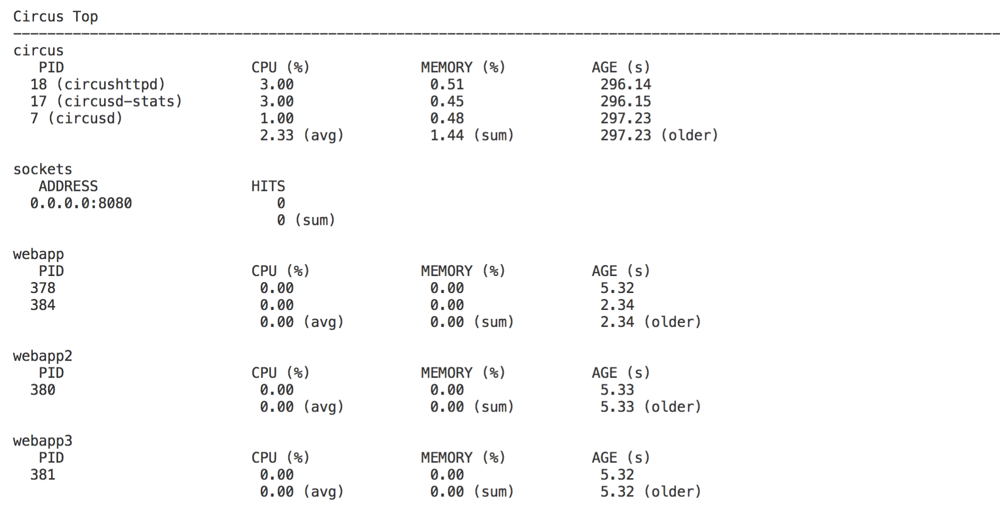
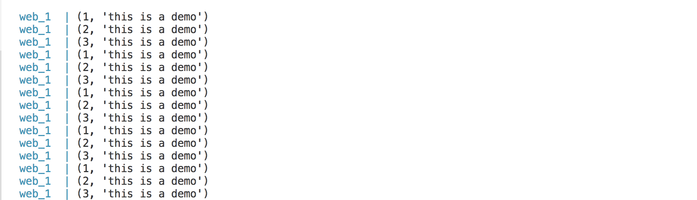

# use circus as a batchworker

## have three batch do different thing

- info.py `print(1, 'this is a demo')`
- info2.py `print(2, 'this is a demo')`
- info3.py `print(3, 'this is a demo')`


## circus config

```code
[circus]
statsd = True
httpd =  True
httpd_host = 0.0.0.0
check_delay = 5
endpoint = tcp://0.0.0.0:5555
pubsub_endpoint = tcp://0.0.0.0:5556
[watcher:webapp]
cmd = python /app/webapp/info.py
numprocesses = 1
shell  = True
[watcher:webapp2]
cmd = python /app/webapp/info2.py
numprocesses = 1
shell  = True
[watcher:webapp3]
cmd = python /app/webapp/info3.py
numprocesses = 1
shell  = True
```

## stats




